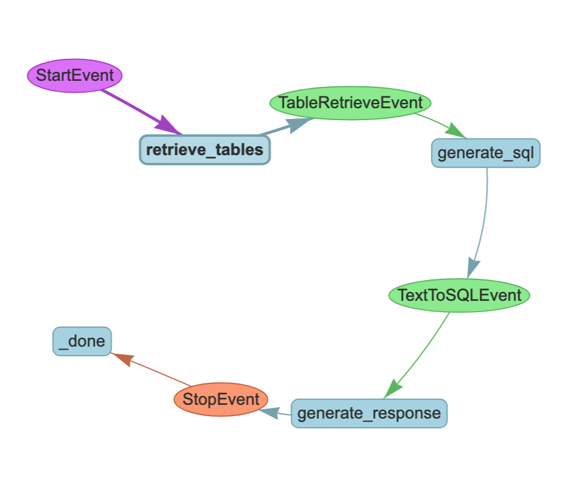

# Agentic App and Eval

## Overview

We implemented an agent to interact with structured data as a text-to-SQL LlamaIndex workflow over any SQL databases.
The agent clients can interact via chat or other protocol like REST API to use the agent for querying data sources in natural language (the chat or API interface are not part of the system). The agent can fit into a layered application architecture or a network of agents, based on the requirements and use cases. 

The agent by design operates on arbitrary structured data (database tables) by resolving schema and relationships at runtime:
 - determines which schema to use
 - converts natural language to SQL query
 - executes SQL query
 - generates text response from the query results.

Note: any text-to-SQL applications are security risks which should be addressed via additional guardrails, user permissions and restricted roles, read-only access, sandboxing, etc.

## Frameworks

 * LlamaIndex for agent workflow, SQL database interface, SQL retriever, data indexing, and LLM interface
 * sqlalchemy for data loading and manipulation
 * sqlite for in-memory database backend
 * Pydantic for structured LLM output
 * RAGChecker for comprehensive evaluation of RAG pipeline with standard metrics across all components of RAG (overall, retrieval, generation)
 * LLM as a judge (JLLM) for custom evaluation (not a package)
 * click package for CLI interface


## Data

 * We use the [WikiTableQuestions dataset](https://ppasupat.github.io/WikiTableQuestions/) (Pasupat and Liang 2015) as our knowledge base.
 * Using `sqlalchemy` and `sqlite` we create SQL Database and load data.
 * Using `llama_index` SQL objects and SQL retrievers we connect and parse databse schema and data.

## Workflow

With LlamaIndex we define an agent as a workflow of the events:



Thus the agent execution involves multiple steps:
1. schema and sample data retrieval from the indexes 
2. text to sql generation 
3. sql retrieval (execution)
4. response generation from the sql results

The ultimate goal is for the agent to support end-to-end RAG pipeline on arbitrary structured data sources resolved at runtime.
Such complexity involves configurations and customizations that affect agent's correctness, efficiency, and performance.


## Dataset

The evaluation dataset contains 4 samples (questions) about random facts found in the dataset loaded:
```
EVAL_DATASET = {
    "B.I.G": {
        "query": "What was the year that The Notorious B.I.G was signed to Bad Boy?",
        "gt_answer": "The Notorious B.I.G was signed to Bad Boy Records in 1993.",
    },
    "BIG": {
        "query": "What was the year that The Notorious BIG was signed to Bad Boy?",
        "gt_answer": "The Notorious BIG was signed to Bad Boy Records in 1993.",
    },
    "best director": {
        "query": "Who won best director in the 1972 academy awards",
        "gt_answer": "William Friedkin won the Best Director award at the 1972 Academy Awards.",
    },
    "Preziosa": {
        "query": "What was the term of Pasquale Preziosa?",
        "gt_answer": "Pasquale Preziosa has been serving since 25 February 2013 and is currently in office as incumbent.",
    },
}
```

## Evaluation

We consider the agent as a RAG system, and hence evaluate and measure the RAG correctness and performance metrics.

### RAG

To perform comprehensive evaluation of the agent we employed special framework for RAG solutions - [RAGChecker](https://github.com/amazon-science/RAGChecker) and [RefChecker](https://github.com/amazon-science/RefChecker/) (see [`ragchecker_eval.py`](ragchecker_eval.py)).
With RAGChecker we can measure comprehensive components of RAG pipeline:
 * retriever metrics: context precision, claim recall
 * generator metrics: context utilization, noise sensetivity, hallucination, self-knowledge, faithfulness
 * overall metrics: precision, reclall, f1

To accomplish this RAGChecker provides a comprehensive suite of metrics for in-depth analysis of RAG performance:


For this exercise we focuson the overall metrics: precision, recall, and F1 (geometric average of precision and recall), but we've built all necessary elements of the evaluation pipeline to expand it to the rest of metrics.


### Agent Versions

#### Version 1.1 
Initial version of the agent that implements all steps of Text-to-SQL with query-time table retrieval

This version showed excellent scores: 
 * precision: 1.0
 * recall: 1.0
 * f1: 1.0
  
but human evaluation of the answers showed that the 2d question was answered correctly (as scored by RAGChecker) only partially: 
> "It appears that there is no available data regarding the year that The Notorious BIG was signed to Bad Boy in the queried database. However, it is widely known that he was signed to Bad Boy Records in 1993."

The agent took upon itself to expand its knowledge beyond the data sources (tables) and answered using innate knowledge of the LLM it calls.

To reduce human in the loop element during evaluation we introduced custom LLM-as-a-judge (JLLM) evaluation step explicitly checks agent answers for the presence of the claim about lack of information. This evaluation simply returns `True` (bad: if such claim is found) or `False` (good: no such claim found in the response) - see `jllm_eval.py`

Thus, JLLM evaluation for version 1.1 scored 1 sample `True`.

#### Version 1.2 
To address the problem above we added additional instruction to the agent's generation prompt to use only data sources available:
>  "Given an input question, synthesize a response from the query results. Only use the information from the SQL Response."

This version showed regression in the scores:
 * precision: 87.5 
 * recall: 75.0 
 * f1: 75.0

 but it showed perfect `False` score with JLLM indicating that the problem with using data beyond data tables is resolved.


Version 2.1

To address regression in the scores we introduced new version of the agent: Text-to-SQL with Query-Time Row Retrieval (along with Table Retrieval).
The problem is that if the user asks a query for "The Notorious BIG" but the artist is stored as "The Notorious B.I.G", then the generated SELECT statement will not return any matches.

We can alleviate this problem by fetching a small number of example rows per table. A naive option would be to just take the first k rows. Instead, we embed, index, and retrieve k relevant rows given the user query to give the text-to-SQL LLM the most contextually relevant information for SQL generation.

This change introduces newer agent with improved workflow that expands schema retrieval (table context) with row retrieval - see changes to the step `retrieve_tables` in the workflow definition in `class TextToSQLWorkflow2` inside `text_to_sql_workflows.py`

Evaluation of this workflow yields perfect scores from both RAGChecker and JLLM.

## Next Steps

Below we discuss improvements, developments, and options for further development of both the agent and the evaluation process.

### System

Of course, the system tested so far can still be improved in various ways:
 * support for multi-table joins and selects
 * augmenting text-to-SQL RAG with vector store, Graph RAG, internet search, file search, custom tools and other hybrid approaches
 * including guardrails and custom validations in the pipeline
 * improving backend engine
 * compare to other agentic frameworks
 * addressing security risks

### Evaluation

Current evaluation primarily addressed problems related to the overall agent correctness.
Next, we will focus on more metrics from RAGChecker that measure system generator and system retriever scores.

The natural evolution of the eval will include adding evaluations using agent traces to monitor its efficiency and the correctness of its elements (e.g. each step of workflow).

Also recommended to expand the set of evaluation metrics to track system performance (e.g. execution time, time to first token, etc.), system guardrails, bias, certain business specific elements.

In fact, using RAGChecker generator metrics would have been helpful in identifying the problem with the agent version 1.1 using LLM to compensate for the lack of retrieved information.

Finally, evaluaiton of risks associated with the text-to-SQL translations presents another massive future work.


## Regressions

Running both RAGChecker and JLLM evals on regular basis insures that we will be able to monitor for regressions in the system due to any changes: workflow, data, configration, etc.

We also suggest continually curate and expand evaluation dataset based on new and updated data sources and use cases.


## Running

See [CLI_USAGE.md](CLI_USAGE.md) on how to run evaluations using CLI interface.

## Challenges

We foresee certain challenges, risks and shortcomings, for example:
  - increasing structured data source complexity and variety may affect agent correctness
  - large data volumes may reduce agent performance
  - Text-to-SQL agent alone may not be sufficient for complete RAG implementation and needs to be combined with other components such as vector store RAG and Graph RAG
  - to scale such agent may require more advanced backend engine
  - to improve such agent may require specialization across vertical data sources
  - more heterogenous data sources may require more complex architecture of text-to-sql workflow
  - there are other agent architectures that may offer more robust solution for such agents
  - text-to-SQL translation involves executing arbitrary SQL queries that presents a security risk.

Some of them could and should be addressed via evaluation and monitoring.

## Great Tool

Solid evaluation tool offers both a toolset and process for continous, intuitive, efficient monitoring, troubleshooting and improving of AI applications from development to production environment. 

It needs to be simple enough just to work, flexible enough to work with wide variety of AI applications, customizable enough to work with various bisiness requirements, and powerfull enough to enhance AI stack.

The field of AI evaluation is still very young, where many technologies are still either immature, or come from legacy applications from before LLM generation.

Agentic AI brings special challenges because it is new, granular, and diverse. Capturing common notes and unifying tones among agentic applications is crtical to succeed for any evaluation platform.

The term evaluation may also include such components as monitoring, observability, reporting, deployment.


## References

 * [LlamaIndex Agent Workflow](https://www.llamaindex.ai/blog/introducing-agentworkflow-a-powerful-system-for-building-ai-agent-systems)
 * [LlamaIndex Text-to-SQL Guide](https://docs.llamaindex.ai/en/stable/examples/index_structs/struct_indices/SQLIndexDemo/)
 * [Structured Data Extraction in LlamaIndex](https://docs.llamaindex.ai/en/stable/examples/structured_outputs/structured_outputs/)
 * [RAGChecker Framework](https://github.com/amazon-science/RAGChecker)
 * [How RAGChecker works: RefChecker](https://github.com/amazon-science/RefChecker/tree/main?tab=readme-ov-file#choose-models-for-the-extractor-and-checker)